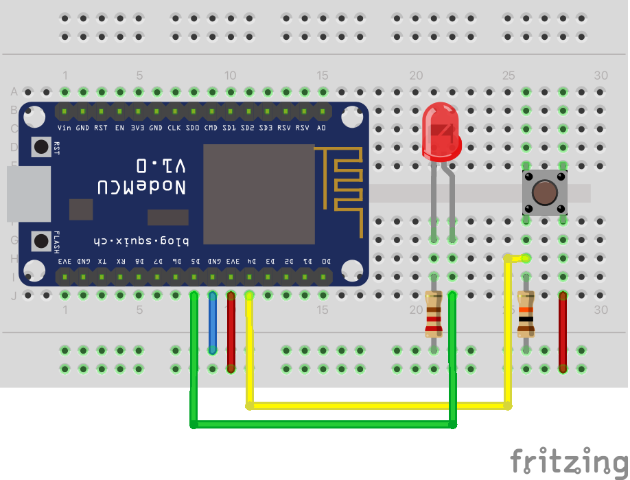

Have you ever missed someone nocking at your door / calling you because you were to busy coding while listening to music on max volume? Well I have, many times...

That's why I made this revolutionary device that can send you an alert on every device with an internet connection!

But how does it work? I will explain it in the following instructions:

### Instructions

#### Required parts:

* [ ] Breadboard
* [ ] NodeMCU
* [ ] Push Button
* [ ] 220 Ω Resistor
* [ ] 10K Ω Resistor
* [ ] A few jumper wires
* [ ] A device with the Telegram aoo installed

And of course the Arduino IDE to flash your board

#### Marche à suivre

##### 1. Telegram Setup

###### 1.1 Creating a bot

First of all you need to create a bot. For this you have to open Telegram and search for "botfather" (you can alternatively click on this link: [t.me/botfather](http://t.me/botfather)). You will be prompted with a "Start" button. Once you click on it it should send you following message:

> I can help you create and manage Telegram bots. If you're new to the Bot API, please [see the manual](https://core.telegram.org/bots).
>
> [...]

Type `/newbot` and follow the instructions to create your bot. It will ask you to give it a name aswell as an username.

Once you're done with that you will recieve a link to access a chat the bot aswell a **bot key** save this key as you will need it later up

###### 1.2 Getting the chat ID

You need the chat ID for the bot to know what chat to send messages to. Here's how to get it:

You first have to connect to the chat with the bot. Send `/start` (or any other message) to initialise your bot.

You then have to send a GET request to the following URL, replacing {{bot_key}} with the key you got earlier

```
https://api.telegram.org/bot{{bot_key}}/getUpdates
```

Response:

```json
{"ok": true,
	"result": 
		[  
			{
				"update_id": XXXXXX,
				"message": {
					"message_id": XX,
					"from": {
						"id": XXXXX,
						"is_bot": false,
						"first_name": "XXXXXX",
						"last_name": "XXXXX",
						"username": "XXXXX",
						"language_code": "XX"  
					},
					"chat": {
						"id": XXXXXX, //this is what you are looking for
						"first_name": "XXXXX",
						"last_name": "XXXXX",
						"username": "XXXXXX",
						"type": "XXXXX"  
					},
					"date": XXXXX,
					"text": "/start",
					"entities": [  
						{
							"offset": 0,
							"length": 6,
							"type": "bot_command"  
						}  
					]  
				}  
			}
		]
}
```

Save that for later aswell.

##### 2. Arduino Libraries

###### 2.1 Universal Arduino Telegram Bot library

You can download the Universal Arduino Telegram Bot library that is used to comunicate with the Telegram Bot API [here](https://github.com/witnessmenow/Universal-Arduino-Telegram-Bot/archive/master.zip)

Follow the next steps to install the latest release of the library.

1. Go to  **Sketch** > **Include Library** >  **Add.ZIP Library..** .
2. Add the library you’ve just downloaded.

###### 2.2 Arduino JSON Library

For older versions of the Arduino IDE you also need to install the Arduino JSON Library. For this

1. Go to  **Skech** > **Include Library** >  **Manage Libraries** .
2. Search for “ArduinoJson”.
3. Install the library.


##### 3. Scematic



In this example I am wiring the LED to `GPIO05` using the 220Ω resistor and the touch button to `GPIO04` with a pulldown using the 10K Ω resistor.

Note that the LED is optional, I decided to use it to show the user when the message is sent.

##### 4. The code

You have to do a few modifications to the code:

| Line | From           | To                               |
| ---- | -------------- | -------------------------------- |
| 8    | your_ssid      | Your actual Wifi SSID            |
| 9    | your_password  | Your actual Wifi Password        |
| 13   | your_bot_token | The bot key we generated earlier |
| 14   | your_chat_id   | The chat ID we collected earlier |


##### 5. Final notes

This project is in now way optimised. I could've used a smaller ESP and have it run off a battery for days, add more buttons for multiple messages, swicth out the sensors for other sensors (for ex a water level sensor that sends me a message whenever my plants need water) But that was not the scope of this project. I wanted to create a quick fix for a small problem I have with parts I had laying around in one evening.


Have fun with it!
